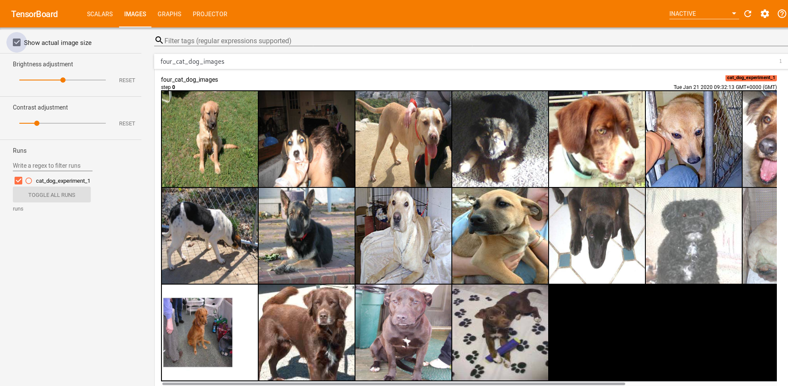
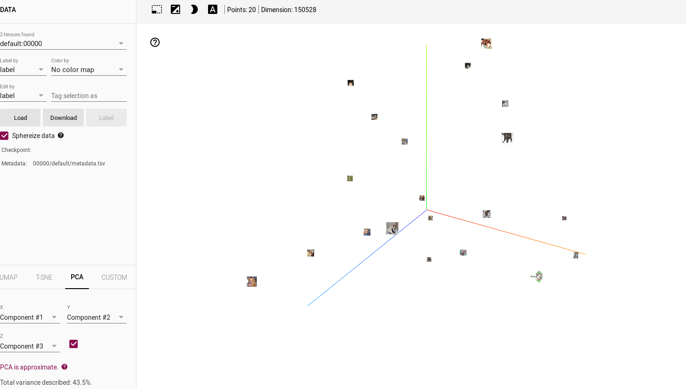
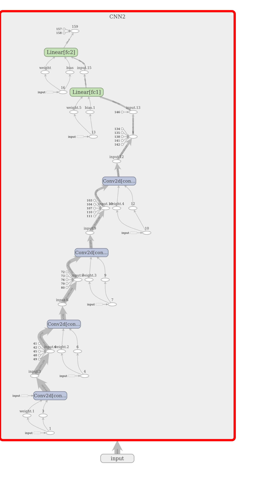

Dog vs Cat Classification

Saphir Volviane Mfogo

## Table of Contents

- [Introduction](#introduction)
- [Requirements](#requirements)
- [Usage](#usage)

## Introduction

This respository contains the Dog vs Cat classifier with CNN

## Requirements

The code is implemented based on [Pytorch 1.3.1](https://pytorch.org/) with CUDA of google colab, Python 3.7.4. 
Please see the 'requirement.txt' file for other requirements.

## Usage

Assuming you are in the Cats_Dogs_classification  master folder the you go in Dog_Cat_Classifier subfolder.

1. Preparation:
* Download the [Dog vs Cat](https://drive.google.com/file/d/1Cn0B9Zr2irUnZcHqODT9IilGHf9fZ61R/view?usp=sharing) dataset 
* Then put them into a folder (Cat_Dog_data/ for example). Please carefully check the directory of the folder 
whether containing invalid characters or image with wrong extension. The data should be structure as follow:
* Cat_Dog_data/train/cat, Cat_Dog_data/train/dog for the training dataset
* Cat_Dog_data/test/cat, Cat_Dog_data/test/dog for the test dataset

3. Training and Evaluation
* To run the code of the first model wich is simple just 2 convolutions
~~~~
$ python main.py 2
~~~~

* To run the code of the Second model wich is a bit complex with 4 convolutions
~~~~
$ python main.py 4
~~~~
please note that if you do not respect the value of the argument you will get an error message.
For instance if you run 
~~~~
$ python main.py 9
you will get the following message:

Wrong argument!!! the model with 9 convolution(s) is not implement

~~~~

## Notes
The  Dog_Cat_Classifier older is a subfolder of Cats_Dogs_classification. 
So when you clone Cats_Dogs_classification repository make sure you go on Dog_Cat_Classifier before run the code

## Experiences
Using [tensorboard](https://pytorch.org/docs/stable/tensorboard.html) we were able to do experience
The first batch sample is visualize as :

Contacts: smfogo@aimsammi.org,  [linkedIn](https://www.linkedin.com/in/volviane-saphir-mfogo-7a181314b/)
